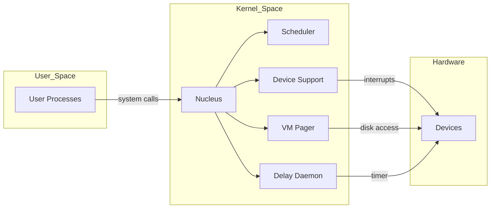

# PandOS Technical Overview

PandOS is an instructional operating system built for the [UMPS3](https://github.com/UniMiB) architecture. The code base is organized into multiple phases that incrementally add functionality ranging from basic process management to a complete virtual memory system. This overview highlights the key design decisions and OS concepts implemented throughout the project.

## Architecture
PandOS follows a microkernel style design. A small nucleus provides essential kernel services such as process scheduling, memory management, and device I/O. Higher level features are implemented as separate modules or user processes. The system starts in `initial.c` which sets up exception vectors, initializes core data structures (PCB free list, ASL, ready queues), and creates the first process running the test suite.

## Process Management
* **Process Control Blocks (PCB)** – Each process is represented by a `pcb_t` structure. The PCB includes queue links, parent/child pointers, processor state, CPU time accounting, and a pointer to optional support structures. Routines in `pcb.c` manage allocation and deallocation, process queues, and the process tree.
* **Scheduler** – `scheduler.c` implements a two‑level priority scheduler with round‑robin time slicing. High priority processes are always favored over low priority ones. When no ready processes exist, the scheduler checks for blocked processes and halts or panics appropriately.

## Synchronization Primitives
The Active Semaphore List (`asl.c`) provides integer semaphores to synchronize access to shared resources. Semaphores are used for device I/O, mutual exclusion, and to implement blocking operations such as `WAITIO` and the delay facility.

## Exception and Interrupt Handling
`exceptions.c` and `interrupts.c` dispatch all traps generated by user programs and devices. System calls are defined in `const.h` and handled via a "Pass Up or Die" approach – unhandled exceptions terminate the offending process. Interrupt handlers manage timer events, device requests, and pseudo‑clock ticks.

## Virtual Memory
Starting in phase 3 the project introduces paging support. Each user process owns a page table stored inside a support structure. `vmSupport.c` provides the pager that handles TLB refill exceptions, allocates frames from a swap pool, performs backing store I/O via flash devices, and uses a FIFO replacement policy. The low‑level TLB refill handler restores entries directly on faults.

## Delay Facility
`delayDaemon.c` implements a sleep service for user processes. Requests are stored in an Active Delay List sorted by wake‑up time. A dedicated Delay Daemon process wakes sleeping processes when the pseudo‑clock ticks past their deadline.

## Build and Test
The repository contains Makefiles for each phase and a collection of user‑level testers under the `testers` and `additionTesters` directories. The kernel image is built for the UMPS3 emulator. Test processes demonstrate process creation, semaphore operations, terminal and printer I/O, and paging behavior.

## Conclusion
PandOS is a complete educational microkernel showcasing classic OS mechanisms: PCB management, a multilevel feedback scheduler, semaphore‑based synchronization, exception/interrupt handling, and a simple demand‑paged virtual memory subsystem. The modular structure allows each feature to be tested independently, making it an ideal reference for discussing operating system fundamentals during technical interviews.

